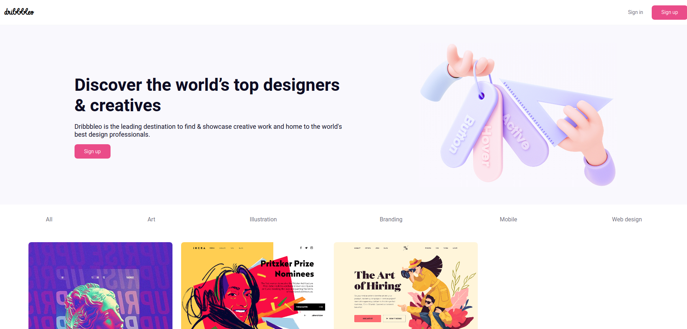
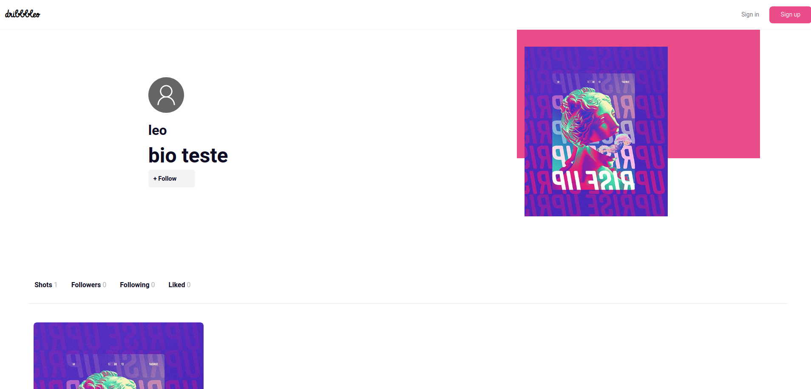
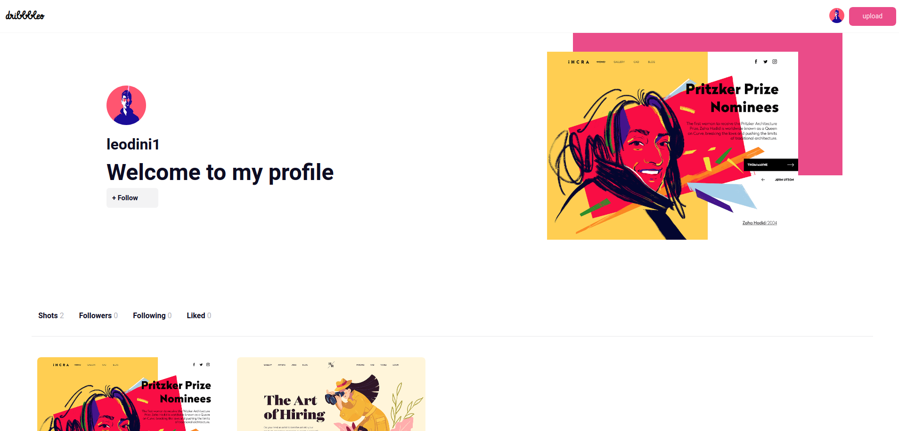
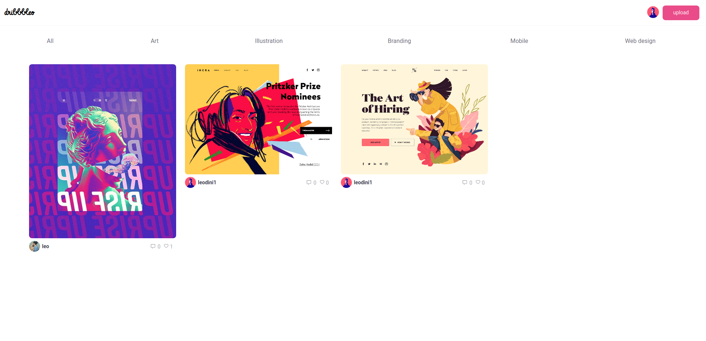

## Dribbbleo

### `About`

### `Client`

Web app made with javascript, Redux and React

you can check the result [here](https://dribbbleo.netlify.app/)

### `Api`

Api made with Node.js using express and mongodb

